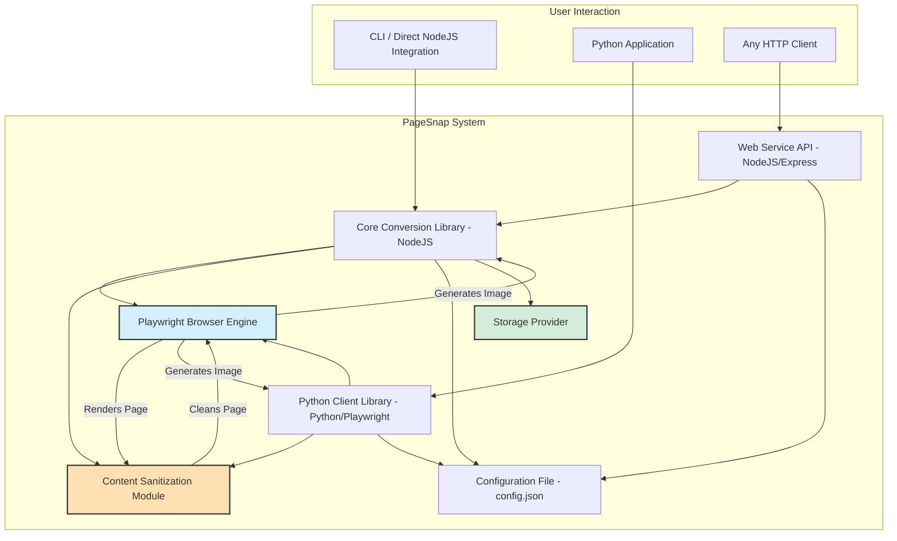

# Design Proposal: "PageSnap" - A High-Fidelity Webpage-to-Image Converter

---

### 1. Overview

This document outlines the design for **PageSnap**, a versatile library and web service for converting webpages into high-quality images. The system is architected to handle modern, dynamic web content with precision and includes a key feature for intelligently removing visual obstructions like popups and ads before capture.

The design prioritizes fidelity, configurability, and flexible integration for both NodeJS and Python environments.

### 2. Core Technology Selection

To meet the requirement of accurately rendering dynamic, commercial webpages, the core of this tool will be built on **Microsoft Playwright**.

**Why Playwright?**
*   **High-Fidelity Rendering:** Playwright operates by controlling full, headless browser engines (Chromium, Firefox, and WebKit). This ensures that pages, including complex JavaScript, CSS animations, and dynamic content, are rendered exactly as they appear to a user.
*   **First-Class Multi-Language Support:** It provides official, actively maintained APIs for NodeJS, Python, .NET, and Java. This directly addresses the requirement for seamless integration into both NodeJS and Python ecosystems without relying on unofficial ports or wrappers.
*   **Powerful Tooling:** It includes robust, built-in features for taking screenshots (`page.screenshot()`), manipulating the DOM, intercepting network requests, and executing custom scripts within the page context, which is essential for the content sanitization feature.

### 3. System Architecture

The system will be composed of three main components, allowing for both direct library usage and a hosted service model.

1.  **Core Conversion Library (`@pagesnap/core`):** A NodeJS package that contains the primary conversion logic.
2.  **Web Service API (`pagesnap-api`):** A lightweight web server (e.g., using Express.js) that exposes the core library's functionality via a RESTful API.
3.  **Python Client Library (`pagesnap`):** A native Python package that utilizes Playwright for Python, providing an idiomatic Python interface to the same core functionality.



### 4. Component Breakdown

#### 4.1. Core Conversion Library (NodeJS)

*   **Functionality:** This will be the heart of the system. It will accept an array of URLs and a configuration object.
*   **Parallel Processing:** It will use a work queue (e.g., using the `p-queue` library) to process multiple URLs concurrently, governed by a `maxConcurrency` parameter in the config to manage system load.
*   **Workflow per URL:**
    1.  Launch a Playwright browser instance.
    2.  Create a new page context.
    3.  Navigate to the URL, waiting for the page to be fully loaded and idle (`waitUntil: 'networkidle'`).
    4.  **Execute the Content Sanitization script**.
    5.  Take the screenshot based on configuration (full page or specified region).
    6.  Generate outputs in all formats specified in the config (`svg`, `png`, `jpg`).
    7.  **Save files using the configured storage provider.**
    8.  Close the page and, eventually, the browser instance.

#### 4.2. Content Sanitization Module

This is the tool's key differentiator. It will remove visual blockers before the screenshot is taken. The approach will be multi-layered:

1.  **Heuristic Analysis:** Inject a script that identifies elements with common blocker characteristics, such as `position: fixed`, a high `z-index`, and viewport-spanning dimensions.
2.  **Selector-Based Blocking:** Utilize community-maintained ad-blocking and annoyance-blocking lists (e.g., EasyList, EasyPrivacy). The tool will parse these lists to build a dynamic set of CSS selectors for known ads, cookie banners, popups, and other nuisances.
3.  **Execution:** Before taking a screenshot, Playwright's `page.evaluate()` function will be used to run a script that finds all elements matching the generated selectors and sets their `display` property to `none`.

#### 4.3. Storage Providers

To accommodate different storage needs, the system will use a provider-based model for outputs.

*   **Interface:** A simple `StorageProvider` interface will be defined with methods like `save(fileName, data)` and `cleanup()`.
*   **Implementations:**
    *   **FileSystem:** Saves the image to the local disk.
    *   **S3/Cloud Storage:** Uploads the image to an S3-compatible bucket. Requires AWS SDK and credentials.
    *   **InMemory:** Stores the image buffer in an in-memory cache. This is ideal for API usage where the image data is returned directly.

#### 4.4. Output Management & Cleanup

*   **Overwriting:** A simple boolean flag `overwrite: true` in the config will allow new images to replace existing ones with the same name.
*   **Expiry (TTL):** The FileSystem and S3 providers will support a `ttl` (time-to-live) property in seconds. A `cleanup()` method on the provider can be triggered periodically to remove expired files.
*   **Resource Management (In-Memory):** The InMemory provider will be implemented as an LRU (Least Recently Used) cache with a configurable `maxSize` (in MB) to prevent memory exhaustion.

#### 4.5. Configuration

A single `pagesnap.config.json` file will control the behavior for all components. CLI arguments can override file settings.

**Example `pagesnap.config.json`:**
```json
{
  "output": {
    "formats": ["png", "svg"],
    "storage": {
      "provider": "filesystem", // "filesystem", "s3", or "in-memory"
      "location": "./snapshots", // Path for filesystem, bucket name for s3
      "overwrite": true,
      "ttl": 86400 // 1 day in seconds
    }
  },
  "performance": {
    "maxConcurrency": 4
  },
  "sanitization": {
    "blockerLists": [
      "https://easylist.to/easylist/easylist.txt"
    ],
    "customRules": [
      "#newsletter-popup"
    ]
  }
}
```

#### 4.6. Web Service API

*   **Framework:** Express.js or Fastify.
*   **Endpoint:** `POST /api/v1/convert`
*   **Behavior:** When the storage provider is set to `in-memory`, the API will return the image data directly. Otherwise, it will return URLs to the saved images.
*   **Request Body:**
    ```json
    {
      "urls": ["https://example.com/article"],
      "formats": ["png"],
      "region": { "x": 0, "y": 0, "width": 1280, "height": 800 }
    }
    ```
*   **Response (In-Memory):**
    ```json
    {
      "results": [
        {
          "url": "https://example.com/article",
          "format": "png",
          "imageData": "iVBORw0KGgoAAAANSUhEUgAAB..."
        }
      ]
    }
    ```

#### 4.7. Python Client Library

*   A native Python package using `playwright-python` to implement the same core logic.
*   It will read the same `pagesnap.config.json` file.
*   **Usage Example:**
    ```python
    from pagesnap import PageSnap
    
    converter = PageSnap() 
    urls = ["https://example.com"]
    results = converter.capture(urls)
    
    # result objects will contain file paths or image data
    # depending on the configured storage provider.
    print(results)
    ```
